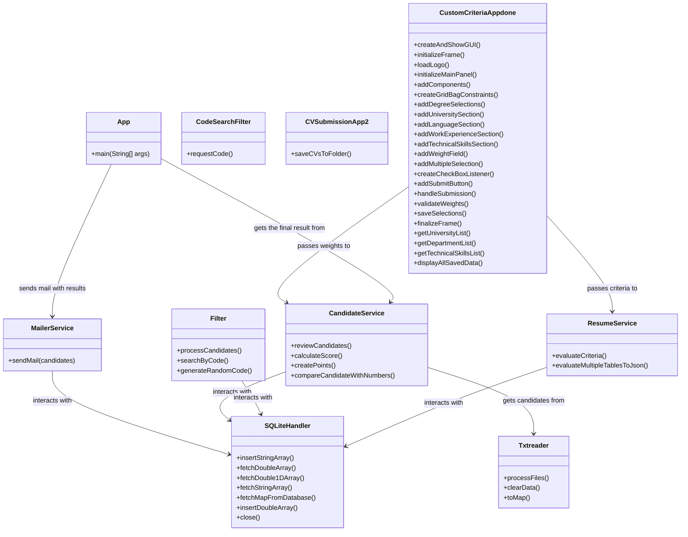

# **myCVision**

## ΟΜΑΔΑ: CYBER SOLVERS

### ΜΕΛΗ:
- Ευθαλία Φακορέλλη: t8230156
- Δέσποινα Σταυροπούλου: t8230142
- Ειρήνη Λιανού: t8230077
- Ιωάννης Βασιλόπουλος: t8220014
- Ειρήνη Στριφτόμπολα: t8230145
- Παντελής Λιακόπουλος: t8230075
- Αθανασίου Θεμιστοκλής: t8230006
- Νικόλας Κλάδης: t8230217

## Περιγραφή
Το **myCVision** είναι ένα λογισμικό που στοχεύει στη βελτιστοποίηση της διαδικασίας πρόσληψης προσωπικού για εταιρείες. Παρέχει αυτοματοποιημένη ανάλυση βιογραφικών, ταξινόμηση βάσει προκαθορισμένων κριτηρίων, και αποστολή αποτελεσμάτων με σκοπό τη μείωση διακρίσεων και την εξοικονόμηση χρόνου για τα τμήματα HR.

---

## Οδηγίες Μεταγλώττισης
Για να εγκαταστήσετε τις εξαρτήσεις και να μεταγλωττίσετε το έργο:
```bash
cd myCVision/src/test/java/com/cybersolvers/mycvision
mvn clean install
```

---

## Οδηγίες Εκτέλεσης
### Εκτέλεση της κύριας εφαρμογής:
```bash
mvn exec:java -Dexec.mainClass="com.cybersolvers.mycvision.App"
```

### Εκτέλεση δοκιμών:
```bash
cd myCVision
mvn test
```

### Δημιουργία αρχείου `.jar`:
```bash
mvn package
```

### Εκτέλεση του αρχείου `.jar`:
```bash
java -jar target/myCVision-1.0-SNAPSHOT-jar-with-dependencies.jar
```

---

## Οδηγίες Χρήσης
1. Εισάγετε τα κριτήρια πρόσληψης μέσω του γραφικού περιβάλλοντος.
2. Καταθέστε τα βιογραφικά σε προαπαιτούμενη μορφή.
3. Το λογισμικό επεξεργάζεται τα δεδομένα και εμφανίζει ταξινομημένη λίστα με τα **ID** και τα **score** των υποψηφίων.
4. Εισάγετε το email σας για να λάβετε τη λίστα με **ID** και **score**.
5. Προαιρετικά, εισάγετε ένα **ID** για να δείτε:
   - Ονοματεπώνυμο
   - Κατάταξη
   - Τελικό σκορ

---

## Δομή Περιεχομένων Αποθετηρίου
- **src/main/java/com/cybersolvers/mycvision**: Κώδικας της κύριας εφαρμογής.
- **src/test/java/com/cybersolvers/mycvision**: Μονάδες δοκιμών.
- **target/**: Περιέχει το παραγόμενο αρχείο `.jar` μετά τη μεταγλώττιση.
- **resources/**: Πρόσθετοι πόροι (εικονίδια, δείγματα δεδομένων κ.λπ.).

---

## Διάγραμμα UML


---

## Επισκόπηση Δομών Δεδομένων και Αλγορίθμων
- **Δομές Δεδομένων**:
  - Χρήση πινάκων και λιστών για την αποθήκευση κριτηρίων και υποψηφίων(LinkedHashMap, Array Tables, List, JSON &Gson).
  - Βάση δεδομένων SQLite για την αποθήκευση και ανάκτηση πληροφοριών.
- **Αλγόριθμοι**:
  - Μετατροπή των κριτηρίων σε μονάδες με βάση τις προτιμήσεις της επιχείρησης.
  - Υπολογισμός βαθμολογιών (score) υποψηφίων μέσω γραμμικών συναρτήσεων.
  - Ταξινόμηση υποψηφίων με βάση τα σκορ.
  - Δημιουργία και αποστολή email με την ταξινομημένη λίστα υποψηφίων.

---


---
Το πρόγραμμα μας δέχεται τα βιογραφικά μόνο σε αυτή τη μορφή txt.

Full Name:
University (Name/No):
Department:
Undergraduate Grade:
Masters University (Name/No):
Masters Department:
Masters Grade:
PhD University (Name/No):
PhD Department:
PhD Grade:
English (Excellent/Very Good/Good/No):
French (Excellent/Very Good/Good/No):
German (Excellent/Very Good/Good/No):
Spanish (Excellent/Very Good/Good/No):
Chinese (Excellent/Very Good/Good/No):
Other Language Level (Excellent/Very Good/Good/No):
Years of Experience:
Office Skills (Excellent/Very Good/Good/No):
Programming Skills (Yes/No):

παράδειγμα συμπληρωμένου txt:

Full Name: Johny Sins
University (Name/No): Massachusetts Institute of Technology
Department: Computer Science
Undergraduate Grade: 3.8
Masters University (Name/No): Stanford University
Masters Department: Artificial Intelligence
Masters Grade: 3.9
PhD University (Name/No): AUEB
PhD Department: DET
PhD Grade: 5.5
English (Excellent/Very Good/Good/No): Good
French (Excellent/Very Good/Good/No): Good
German (Excellent/Very Good/Good/No): Very Good
Spanish (Excellent/Very Good/Good/No): No
Chinese (Excellent/Very Good/Good/No): No 
Other Language Level (Excellent/Very Good/Good/No): No
Years of Experience: 5
Office Skills (Excellent/Very Good/Good/No): Excellent
Programming Skills (Yes/No): No

---
